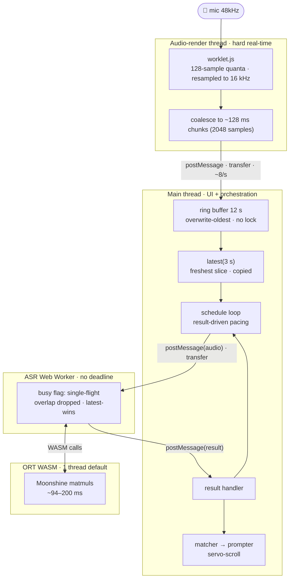

# Cue

A proof-of-concept PWA teleprompter that **listens to the narrator** and
scrolls to wherever they are in the script, instead of forcing a fixed pace.

- Markdown script rendering (open a `.md` file, drag & drop, or the demo)
- [Moonshine](https://github.com/moonshine-ai/moonshine) (`moonshine-tiny`)
  running fully in-browser on WASM via
  [transformers.js](https://github.com/huggingface/transformers.js) — no audio
  leaves the device. Its compute scales with the audio length instead of
  Whisper's fixed 30 s frame, so it's fast (~94–200 ms/inference) and reliable
  on every browser and phone tested.
- Fuzzy local alignment of the live transcript against the script, so
  misheard words, pauses, or small improvisations don't derail tracking.
- Proportional scroll controller: the further ahead you speak, the faster
  it scrolls; pause and it waits.
- Device-local text size, mirror, and keep-awake preferences.
- PWA: installable, app shell works offline after first load.

## Architecture

```
js/app.js         orchestrator + UI wiring
js/constants.js   shared release manifest + ASR/audio tuning levers
js/directives.js  Cue directive parser + execution helpers
js/md.js          minimal markdown -> HTML renderer
js/prompter.js    word-span wrapping, highlight, scroll controller
js/matcher.js     Smith-Waterman-ish transcript/script alignment
js/audio.js       getUserMedia -> 16 kHz PCM ring buffer
js/worklet.js     AudioWorklet that resamples and batches mic samples
js/asr-worker.js  Web Worker running Moonshine (WASM) via transformers.js
js/perf.js        rolling ASR perf sampler (beacons summaries to the Worker's /log)
worker.js         Cloudflare Worker: serves assets, proxies model files, collects logs
vite.config.js    hashed production assets + generated Workbox app-shell cache
```

The ASR loop snapshots the last ~3 s of audio whenever the worker is idle
(gated on RMS so silence isn't transcribed), transcribes it, and feeds the tail
of the transcript to the matcher. The matcher aligns it against a window around
the current cursor and moves the cursor only on a confident, forward-biased
match; the prompter then servo-scrolls that word to the reading line.

### Threads & data flow

Four threads, each with a different deadline. Data flows one way, and every
stage **discards or overwrites rather than queues** — so memory is bounded,
nothing locks, and a slow device degrades to _lag_, not _collapse_.



## Run locally

```
npm install
npm run dev
```

Open the local URL printed by Vite. Mic access requires `localhost` or HTTPS.

## Tests

Unit tests for the pure logic — transcript/script alignment (`matcher.js`) and
markdown rendering incl. the link-scheme allowlist (`md.js`) — on Node's
built-in runner, no build step or framework:

```
npm test
```

## Deploy

Vite emits content-hashed client assets and a Workbox service worker. The
Cloudflare Worker (`worker.js`) serves those assets, proxies model files, and
collects client logs. Configure the Git integration to run `npm run build` and
deploy using `dist/cue/wrangler.json`. To deploy manually:

```
npx wrangler login   # once
npm run deploy
```

Cue checks for releases on launch, when returning to the foreground, and while
left open but not listening. It downloads the small app shell in the background,
then reveals **Update available** in the menu when a release is ready. Selecting
it opens a confirmation before Cue disposes the ASR worker, activates the release,
and reloads. The option remains hidden while listening and returns after Stop if
an update is pending. If the browser does not report activation promptly, Cue
performs one guarded fallback reload after confirmation. A staged update also
activates naturally after every old Cue window is closed, so reopening Cue normally
applies it without interrupting a session. The speech model is not part of the
app-shell download and remains cached unless its model revision changes.

## Keys

- **Esc** — stop listening
- **↑ / ↓** — nudge the cursor / re-anchor the matcher
- Mouse wheel / touch — manual override (auto-scroll resumes after ~2.5 s)

## Cue directives

Cue recognizes standalone directives written as HTML comments, so they remain
invisible in other Markdown tools. The first supported action stops listening
at that point in the script. Directives must occupy their own line; inline
directives are treated as ordinary script text and will not fire:

```md
<!-- cue:stop -->
```

An optional message appears in the stop dialog:

```md
<!-- cue:stop message="Wait for applause" -->
```

Choose Continue to restart listening after the marker, or Cancel to dismiss the
dialog and remain stopped at that position. When no message is authored, the
dialog shows a default explanation. Starting over or deliberately seeking
behind the marker re-arms the directive. Attribute values use double quotes;
unsupported actions, attributes, and malformed directives are reported when
the script is loaded. Enable **Show cues** in the menu to display directives at
their authored positions. Hover, focus, or tap a marker to reveal its attributes;
marker labels remain outside speech matching.

## Known PoC limitations

- English only (`moonshine-tiny`); swap the model id for other languages.
- First load downloads the model weights (~30 MB), cached by the browser
  afterwards.
- Cue directives follow the recognized reading position, so an action can fire
  a few words after its marker during continuous delivery. A brief pause at the
  boundary gives Cue time to recognize the final phrase.
- Scripts containing similar or repeated passages can occasionally cause the
  matcher to jump to a later occurrence. Splitting repeated material into
  separate scripts keeps the matching scope smaller; future `cue:next` and
  `cue:goto` directives could orchestrate those scripts without combining them
  into one document. For now, they can recover by stopping, scrolling back, and
  tapping the intended word to re-anchor Cue.
- The markdown renderer covers a sane subset — exotic Pandoc constructs
  (tables, definition lists, math) degrade to plain paragraphs.

## License

Cue is available under the [Apache License 2.0](LICENSE).
