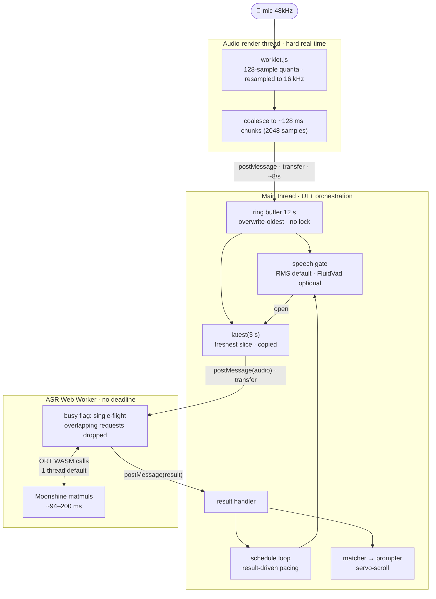

# Cue

**Note:** have started extracting a library from this into [cue-cursor.js](https://github.com/erdke/cue-cursor.js).

A proof-of-concept PWA teleprompter that **listens to the narrator** and
scrolls to wherever they are in the script, instead of forcing a fixed pace.

- Markdown script rendering (open a `.md` file, drag & drop, or the demo)
- [Moonshine](https://github.com/moonshine-ai/moonshine) (`moonshine-tiny`)
  running fully in-browser on WASM via
  [transformers.js](https://github.com/huggingface/transformers.js) — no audio
  leaves the device. Its compute scales with the audio length instead of
  Whisper's fixed 30 s frame, so it's fast (~94–200 ms/inference) and reliable
  on every browser and phone tested.
- Fuzzy local alignment of the live transcript against the script, so
  misheard words, pauses, or small improvisations don't derail tracking.
- Proportional scroll controller: the further ahead you speak, the faster
  it scrolls; pause and it waits.
- Device-local text size, mirror, and keep-awake preferences.
- Local post-session review with duration, overall pace, and script markers for
  long pauses, re-reads, and manual re-anchors.
- PWA: installable, app shell works offline after first load.

## Architecture

```
hug-models.json      pinned model dependency manifest
js/app.js            orchestrator, UI wiring, speech-gate selection, and ASR loop
js/asr-worker.js     Web Worker running Moonshine (WASM) via transformers.js
js/audio.js          getUserMedia -> 16 kHz PCM ring buffer
js/constants.js      shared release manifest + ASR/audio tuning levers
js/fluid-vad-gate.js streaming FluidVad adapter with a latched speech decision
js/matcher.js        Smith-Waterman-ish transcript/script alignment
js/md.js             minimal markdown -> HTML renderer
js/perf.js           rolling ASR/VAD perf sampler (beacons summaries to /log)
js/prompter.js       word-span wrapping, highlight, scroll controller
js/session-analytics.js local session timing and objective review moments
js/speech-gate.js    RMS baseline gate calculations
js/worklet.js        AudioWorklet that resamples and batches mic samples
vite.config.js       hashed production assets + generated Workbox app-shell cache
worker.js            Cloudflare Worker: serves assets, proxies model files, collects logs
```

The ASR loop snapshots the last ~3 s of audio whenever no inference is pending.
By default, an RMS gate prevents silence from being transcribed. Users can opt in
to **Enhanced detection** in the menu; this streams mic chunks through
FluidVad and latches detected speech until the next inference. Its ~2.5 MB transfer
is loaded once on demand and then reused from the browser cache. If FluidVad cannot
load or fails at runtime, Cue falls back to RMS. The transcript tail is then aligned
against a window around the current cursor. The matcher moves the cursor only on a
confident, forward-biased match, and the prompter servo-scrolls that word to the
reading line.

Session analytics are derived during the reading and kept in memory only. Cue
does not retain audio or send the review report through its performance logging.

### Threads & data flow

There are three browser execution contexts in the default configuration: the
main thread, the audio-render thread, and the ASR Web Worker. ONNX Runtime's WASM
compute runs inside the ASR worker with one thread by default; the diagnostic
`?threads=N` override may ask it to create additional WASM workers. Data flows
one way, and each stage **discards or overwrites rather than building an
unbounded queue** — so memory is bounded and a slow device degrades to _lag_,
not _collapse_.



## Run locally

```
npm install
npm run dev
```

Open the local URL printed by Vite. Mic access requires `localhost` or HTTPS.

## Tests

Tests cover transcript/script alignment, prompter anchoring, Markdown rendering,
settings, constants, audio/speech-gate boundaries, and FluidVad behaviour using
small speech and typing WAV fixtures. They run on Node's built-in test runner,
with no build step or test framework:

```
npm test
```

## Deploy

Vite emits content-hashed client assets and a Workbox service worker. The
Cloudflare Worker (`worker.js`) serves those assets, proxies model files, and
collects client logs. Configure the Git integration to run `npm run build` and
deploy using `dist/cue/wrangler.json`. To deploy manually:

```
npx wrangler login   # once
npm run deploy
```

Cue checks for releases on launch, when returning to the foreground, and while
left open but not listening. It downloads the small app shell in the background,
then reveals **Update available** in the menu when a release is ready. Selecting
it opens a confirmation before Cue disposes the ASR worker, activates the release,
and reloads. The option remains hidden while listening and returns after Stop if
an update is pending. If the browser does not report activation promptly, Cue
performs one guarded fallback reload after confirmation. A staged update also
activates naturally after every old Cue window is closed, so reopening Cue normally
applies it without interrupting a session. The speech model is not part of the
app-shell download and remains cached unless its model revision changes. The
optional FluidVad WASM asset is also loaded separately rather than precached as
part of the app shell; once fetched, normal browser caching applies.

## Keys

- **Esc** — stop listening
- **↑ / ↓** — nudge the cursor / re-anchor the matcher
- Mouse wheel / touch — manual override (auto-scroll resumes after ~2.5 s)

## Known PoC limitations

- English only (`moonshine-tiny`); swap the model id for other languages.
- First load downloads the model weights (~30 MB), cached by the browser
  afterwards.
- Scripts containing similar or repeated passages can occasionally cause the
  matcher to jump to a later occurrence. For now, users can recover by stopping,
  scrolling back, and tapping the intended word to re-anchor Cue. A future
  sequenced-script format could isolate matching scopes for repeated material.
- The markdown renderer covers a sane subset — exotic Pandoc constructs
  (tables, definition lists, math) degrade to plain paragraphs.

## License

Cue is available under the [Apache License 2.0](LICENSE).
